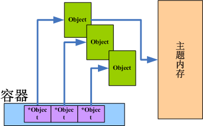

# 原理

## 一、基本模型
### 1.容器内存模型
容器是EasyC其最大的特点之一, 其最基本的思想是"交给容器的数据/内存，由容器管理。容器返回的关联内存，同样由容器管理。"
#### 1).关联内存
`关联内存`这一术语仅限于EasyC中，该术语描述了由容器生成的一些内存和容器自身具备关联性，并且容器在释放时，会自动释放关联内存。
```C
String *s = newString("hello");		// 初始化String对象
s->append(s, " ")->append(s, "World");		// 拼接
char * chars = s->toChars(s);		// 以字符形式返回String对象中的字符数据, chars所指向的内存属于关联内存
printf("%s", chars);		// 显示关联内存
freeString(s);		// 释放s, 同时会自动释放关联内存
```
这里`s->toChars(s)`返回的是关联内存, 关联内存的释放不由程序员进行管理，并且程序员也不应该管理，统一交由容器管理释放。并且关联内存具备临时性:
```C
printf("%s", s->toChars(s));
freeString(s);
```
可以即时的打印字符串，并且不需要程序员去释放该字符串的内存。该字符串内存的空间的释放推迟到了字符串释放的时候。<br>
由容器的某个方法生成并返回的内存并不一定是关联内存，非关联内存同样需要由程序员管理。容器返回的哪些是关联内存在API中有详细描述。
#### 2).主题内存
easyc中有一个特殊的容器类：`Object`，这个类被其他所有容器使用，并且是其他容器保存数据的基本单元。Object包装了一个指针，该指针指向实际使用的内存。下图描述了容器，Object和主题内存的关系。


我们向容器中保存数据时，会将这个`数据地址`存放在Object中，再将Object放在容器中。这个`数据地址`指向了我们用户使用的数据，因此该地址所指向的内存称为`主题内存`。

#### 3).Object
前一节介绍了主题内存被Object的指针所指向，在这里介绍下Object的作用。Object更为详细的原理和使用请参照后面的[Object原理]()和[ObjectAPI]()
Object是一个特殊的容器，仅由其他容器使用，程序员基本没有使用Object的相关场景。Object是对数据的一层抽象，提供了一系列的API以便容器管理。以下是Object的结构类型：
```C
struct Object{
	void *item;
	void*(*itemCopy)(void *item);
	void (*itemFree)(void *item);
	String *(*itemToString)(void *item);
};
```
这里的`*item`就是指向主题内存的指针。很明显，Object中缓存了3个基本方法：`itemCopy, itemFree和itemToString`，分别管理了item的拷贝，空间释放以及字符串化。

用户再使用容器存放数据的时候，需要指定数据的管理方式，其中包括数据的`复制方案，释放方案和字符串化方案`，当这些确定以后，用户就不用自己去管理数据内存的释放了，容器在释放的时候将会自行调用其中每个Object的itemFree以此释放。

因为常用的数据主要是整数，浮点数和字符数组，因此会有这几种类型的Object自动生成函数，避免用户编写冗长的参数。具体会在[Object原理]()中讨论。
### 2.编程规范
#### 1).类OOP风格
C是面向过程的语言，不具备面向对象中的多态，继承和封装特性(具备一定的封装能力，但是缺乏public和private等限制权限的声明语法)，无法设计OOP风格的程序，甚至强制性的OOP编程风格会让人感觉`画蛇添足`，但是EasyC仍然采用OOP的设计风格原因如下：
* 命名空间
	命名空间最大的优势是不同的结构体可以包含同名的方法，例如`HashMap`和`Vector`均包含了`get`方法。否则会给get方法放上冗长的前缀修饰如`hashMapGet`和`vectorGet`。
* 易读性
	易读性主要体现在OOP风格可以提供更灵活的编程方案并且方便熟悉OOP的程序员阅读，例如对一个字符串进行连续的拼接：
```C
int age = 24;
String *s = newString("");
s->append(s, "age")->append(s, age)->...;
```
可以通过类似以上的链式结构提供更好的可读性。否则会像`append(append(s, "age"), age), ... )));`这样子来进行拼接，后面部分冗长的反括号非常令人厌恶。

#### 2).容器的创建与释放

#### 3).主题内存，关联内存以及非关联内存的释放

#### 4).内存泄露检测方案
EasyC适合于`Visual Studio 2013`及其以上版本的环境中使用，在Visual Studio 2013自带了内存泄露的检测。建议大家多进行检测，帮助开发人员解决隐藏BUG。
```C
#define _CRTDBG_MAP_ALLOC
#incldue <crtdbg.h>
int main(){
	<user code>
	_CrtDumpMemoryLeaks();
}
```
如上程序所示，`_CrtDumpMemoryLeaks()`放在进程的末尾，会在程序结束后指出哪些通过malloc申请的内存没有释放，若按照规范编写程序后仍然有内存泄露的情况，请和在[这里](https://github.com/swjtuISL/EasyC/issues)和开发人员联系，谢谢。
C语言的内存泄露时有发生，并且很难控制，但是只需要按照内存模型和编程模型的规范进行编程，就可以提高代码的可维护性、可读性并且可以避免C语言中的内存泄露问题。